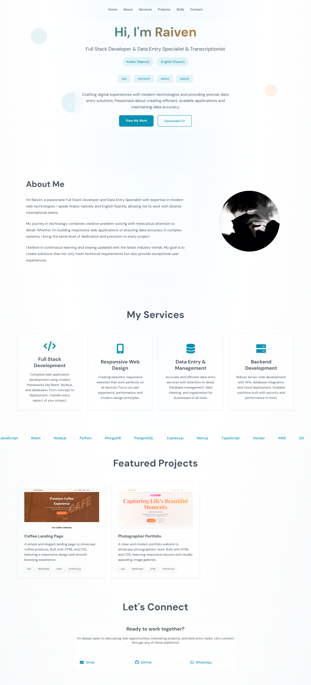

# 🌐 Personal Portfolio Website

A modern and responsive personal portfolio website to showcase projects, skills, and experience.  
Built with **HTML, CSS, and JavaScript**, featuring a clean design, GitHub integration, and project auto-fetching.

---

## 📸 Mockup Preview

Here’s a preview of the portfolio:



---

## ⚙️ Configuration

This project fetches repositories dynamically from **GitHub API**.  
To make it work for your own account, you need to update some variables inside `github.js`.

```js
const username = "raivenrt"; // Your GitHub username
const url = `https://api.github.com/users/${username}/repos`; // GitHub API endpoint
const CACHE_EXPIRY = 1 * 60 * 60 * 1000; // Cache duration (1 Hour)
const CACHE_KEY = `${username}_repos`; // LocalStorage key
```
